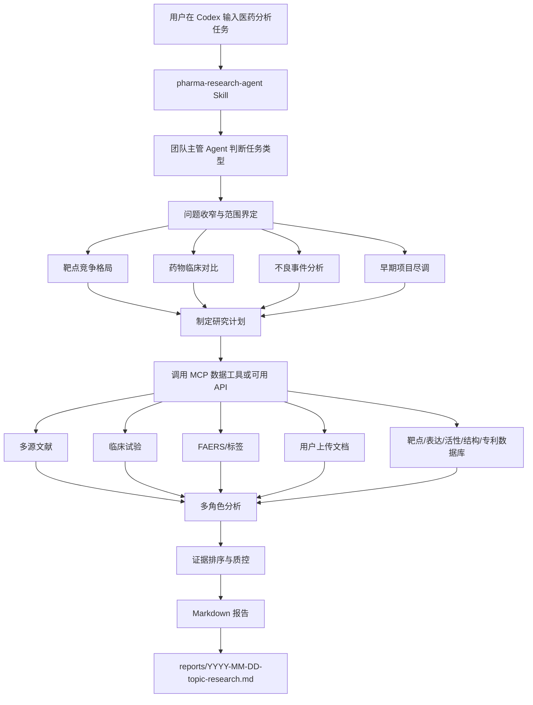
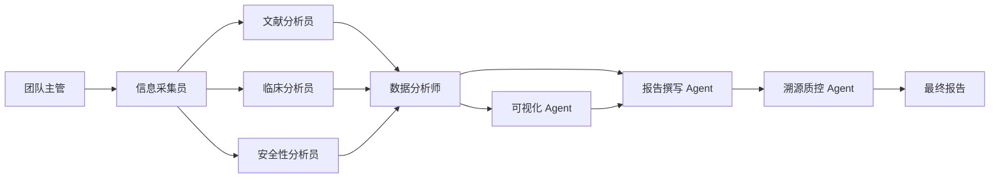

# 医药分析多角色智能体需求与实现方案

## 1. 项目定位

本项目用于在 Codex 中长期运行一个内部医药分析多角色智能体。它不是传统 SaaS 网站，也不是一次性提示词，而是一套 Codex 原生工作流包：Skill 负责调研流程、角色分工、报告模板和质控规则；MCP 工具负责真实数据源查询和结构化返回。

目标是让用户在 Codex 中输入一个医药研究问题后，系统能像一个小型分析团队一样完成：问题澄清、范围界定、研究计划、数据检索、证据抽取、主题分析、图表建议、Markdown 报告和引用附录。

## 2. 目标用户与场景

| 用户 | 典型问题 | 期望结果 |
| --- | --- | --- |
| 医药战略/BD | 某靶点全球竞争格局如何？ | 管线、适应症、公司、阶段、差异化机会 |
| 早期研发/BD | 某早期项目是否值得立项、投资或继续推进？ | 靶点有效性、制剂可行性、非临床转化、缺陷和失败路径 |
| 临床研发 | 两个药物在某适应症上如何对比？ | 试验设计、终点、疗效、安全性、标签证据 |
| 药物安全/医学 | 某药物的不良事件信号如何？ | FAERS 趋势、标签风险、文献安全性证据 |
| 咨询/情报分析 | 某课题有哪些证据和空白？ | 证据表、判断、待补充数据 |

## 3. 总体架构

## 4. 多角色协作设计

角色细节存放在 `.agents/skills/pharma-research-agent/references/role-cards.md`。Skill 运行时应按需读取角色卡，而不是把所有角色细节写进主提示。

## 5. 四类主题研究流程

### 5.1 靶点竞争格局

输入示例：`分析 CLDN18.2 在胃癌中的全球竞争格局。`

流程：

1. 识别靶点、适应症、地区和时间范围。
2. 检索 PubMed、PMC、Europe PMC、OpenAlex、ClinicalTrials.gov 和用户上传管线表。
3. 解析靶点机制、疾病相关性、主要药物/项目、公司和临床阶段。
4. 输出适应症分布、公司阶段矩阵、研发时间轴和差异化机会。

### 5.2 药物临床对比

输入示例：`比较 nivolumab 和 pembrolizumab 在胃癌中的临床证据。`

流程：

1. 识别药物、适应症、比较范围、治疗线数、人群、方案、给药方式和结局指标。
2. 如果范围不清，先提出澄清问题；如果用户授权智能体决定，写出默认范围和排除场景。
3. 先检索直接头对头试验；若没有成熟结果，再定义强间接证据集合和背景证据集合。
4. 检索 ClinicalTrials.gov、PubMed、PMC、openFDA Label、Crossref 和可用会议/公司资料。
5. 抽取试验设计、分期、入组、终点、疗效、安全性和标签信息。
6. 输出临床试验对比表、直接证据、间接证据、安全性差异和综合判断。

通用原则：药物临床对比不直接混合所有适应症或所有研究，而是先用 PICO/PECO 收窄到一个核心问题。核心证据集合优先包括目标干预与目标对照的直接头对头研究；若没有成熟结果，再使用同治疗线、相似人群、相似方案的强间接证据，并把早期、单臂、不同治疗线、不同亚型或不同给药方式的研究放入背景证据。

### 5.3 不良事件分析

输入示例：`分析 osimertinib 相关间质性肺病的不良事件信号。`

流程：

1. 识别药物、反应术语、时间范围和别名。
2. 检索 openFDA FAERS、openFDA Label、PubMed、Europe PMC 和 medRxiv。
3. 聚合报告数、严重报告、年份趋势、标签风险和文献安全性证据。
4. 输出信号概览、标签一致性、文献证据和待补充数据。

### 5.4 早期项目第三方尽调

输入示例：`评估某靶点 ADC 项目在某适应症中的非临床可行性和主要缺陷。`

流程：

1. 识别靶点、适应症、制剂/技术路线、项目阶段、已知资料和决策目的。
2. 将项目假设拆解为靶点有效性、制剂适配性、非临床药效、PK/PD、毒理安全、竞品与失败先例、专利与差异化。
3. 检索 PubMed/PMC、Open Targets、UniProt、HPA/GTEx、ChEMBL/BindingDB、PDB/AlphaFold、ClinicalTrials.gov、专利和权威会议/公司公告。
4. 每个维度同时整理支持证据和反对证据；对单一模型、过表达系统、公司材料、会议摘要和普通网页线索降级处理。
5. 项目质疑 Agent 单独提出关键缺陷、失败路径和必须补充的去风险实验。
6. 输出可行性评分矩阵、第三方结论和 Go/No-Go 建议。

## 6. 数据源设计

| 数据类别 | 主要来源 | 关键用途 |
| --- | --- | --- |
| 医学文献 | PubMed, PMC, Europe PMC | 摘要、全文、机制、临床和安全性证据 |
| 出版元数据 | Crossref | DOI、期刊、日期、去重 |
| 学术图谱 | OpenAlex, Semantic Scholar | 引用、机构、相关论文、趋势 |
| 预印本 | bioRxiv, medRxiv | 最新前沿和早期证据 |
| 临床试验 | ClinicalTrials.gov API v2 | NCT、阶段、状态、终点、申办方 |
| 不良事件 | openFDA Drug Event | FAERS 聚合、反应术语、趋势 |
| 标签 | openFDA Drug Label | 适应症、警告、不良反应、剂量 |
| 靶点与蛋白 | Open Targets, UniProt, NCBI Gene, Ensembl | 靶点-疾病证据、蛋白功能、结构域 |
| 表达与组织分布 | Human Protein Atlas, GTEx, Bgee, ENCODE | 正常组织表达、患者样本、潜在 on-target 毒性 |
| 活性与结构 | ChEMBL, BindingDB, PubChem, PDB, AlphaFold | 已知配体、活性、可成药性、结构可及性 |
| 通路与互作 | Reactome, GO, STRING | 机制位置、通路冗余和上下游补偿 |
| 专利 | PatentsView, Google Patents Public Datasets / BigQuery, EPO OPS, Espacenet, Lens | 核心结构、用途、组合、制剂、同族、申请人、趋势和绕开空间 |
| 内部资料 | 用户上传文件 | 内部 PDF、Word、Excel、PPT、图片、表格 |

多源文献优先级和字段要求见 `.agents/skills/pharma-research-agent/references/data-source-map.md`。

## 7. Codex Skill 设计

Skill 位于 `.agents/skills/pharma-research-agent/SKILL.md`。它只保留高层触发规则和执行步骤：

1. 判断任务是否属于医药深度调研。
2. 分类为靶点竞争格局、药物临床对比、不良事件分析、靶点验证、制剂可行性、非临床证据评估或早期项目尽调。
3. 按需读取角色卡、报告模板、数据源地图和证据规则。临床与安全任务读取通用参考文件；早期项目任务读取 `early-asset-*` 专用参考文件，避免 prompt 过大。
4. 临床对比或宽泛肿瘤问题先读取问题收窄规则，并输出范围声明。
5. 生成研究计划。
6. 调用 MCP 或可用 API 检索数据。
7. 生成报告并输出引用附录。

这种设计遵循 Codex Skill 的渐进式披露原则，避免每次运行都加载所有背景材料。

## 8. MCP 工具规划

MCP 服务目录为 `mcp-server/`，可导入代码位于 `mcp_server/`。当前已实现文献检索、临床试验检索、药品标签检索、不良事件检索和专利检索原型，并已可通过同一个 `pharma_research` MCP server 暴露给 Codex。

核心工具：

- `search_literature(query, sources, date_range, max_results)`：已实现 PubMed、Europe PMC、Crossref；后续扩展 OpenAlex、Semantic Scholar、bioRxiv、medRxiv。
- `search_clinical_trials(condition, intervention, phase, status, max_results)`：已实现 ClinicalTrials.gov API v2。
- `search_drug_labels(drug, max_results)`：已实现 openFDA Drug Label。
- `search_adverse_events(drug, reaction, date_range, max_results)`：已实现 openFDA FAERS 聚合。
- `search_patents(query, jurisdictions, date_range, max_results)`：已实现 PatentsView 结构化检索原型；公共源不可用时返回 Google Patents、Espacenet、PatentsView 检索入口。后续专利 landscape 和批量统计优先接入 Google Patents Public Datasets / BigQuery，并要求执行前估算扫描量和限定 SQL 条件。
- `fetch_publication_detail(ids, source)`：待实现。
- `normalize_entities(text, entity_types)`：待实现。
- `rank_evidence(items, research_question)`：待实现。

详细输入输出见 `mcp-server/tool-contracts.md`。
## 9. 报告输出规范

默认报告保存到：

`reports/YYYY-MM-DD-topic-research.md`

报告必须包含：

- 执行摘要
- 研究问题与范围
- 范围界定与排除场景
- 数据源与检索策略
- 核心发现
- 证据表
- 图表建议
- 直接证据
- 综合判断
- 待补充证据
- 引用与来源附录

报告模板位于 `.agents/skills/pharma-research-agent/references/report-templates.md`。

## 10. 验收标准

### 文档验收

- 覆盖产品定位、角色、流程、数据源、Codex 运行形态、MCP 工具、报告模板和实施路线。
- 能让另一个工程师直接开始制作 Skill 和 MCP 原型。

### Skill 验收

- Codex 能根据“分析某靶点竞争格局”“比较两个药物临床数据”“分析某药不良事件”触发该 Skill。
- Skill 能按主题选择正确报告模板。
- Skill 只按需读取 reference 文件。

### MCP 规划验收

- 每个工具都有明确输入、输出、数据源和失败处理策略。
- 文献源支持多源合并和去重。
- 输出保留 PMID、DOI、NCT ID、openFDA 查询 URL 等可追溯标识。

### 报告验收

- 三类主题均有模板。
- 每份报告包含证据表和引用来源。
- 结论区区分“直接证据”“综合判断”“待补充证据”。

## 11. 实施路线

| 阶段 | 目标 | 产物 |
| --- | --- | --- |
| V0 | 工作流方案落地 | Skill、参考资料、MCP 契约、主文档 |
| V1 | 文献和临床真实查询 | PubMed/Europe PMC/Crossref、ClinicalTrials.gov 已实现 |
| V2 | 安全性、标签和专利查询 | openFDA FAERS/openFDA Label 已实现；专利检索原型已实现 |
| V3 | 早期项目尽调工作流 | 早期项目角色卡、数据源地图、证据规则、报告模板 |
| V4 | 多源去重和证据排序 | normalize_entities/rank_evidence 工具 |
| V5 | 团队复用 | 打包为 Codex Plugin |
